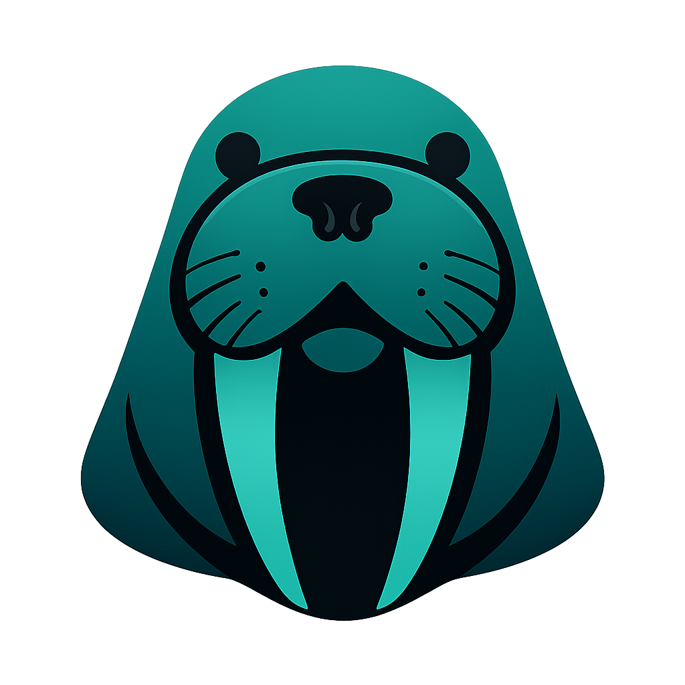

<div align="center">
  
  <h1>Zap that Dupple</h1>
  <p><strong>AI-powered duplicate file finder for macOS and Windows</strong></p>

  <p>
    
    
    
    
    
  </p>

  <p>
    <a href="#-features">Features</a> •
    <a href="#-installation">Installation</a> •
    <a href="#-building">Building</a> •
    <a href="#-ai-models">AI Models</a> •
    <a href="#-how-it-works">How it works</a> •
    <a href="#-using-the-app">Using the App</a> •
    <a href="#-troubleshooting">Troubleshooting</a> •
    <a href="#-license">License</a>
  </p>
</div>

---

## Screenshots
<div align="center">


</div>

---

## ✨ Features

- **AI semantic search** — finds duplicates even when files have different names, sizes, or quality
- **Multi-format support** — images, video, audio, documents, all in one pass
- **HEIC/HEIF** — natively reads iPhone photos without conversion
- **Apple Silicon MPS** — CLIP and text models run on-device GPU via Metal Performance Shaders
- **Three-pass algorithm** — MD5 exact match → perceptual hash → AI embeddings
- **SQLite cache** — re-scans skip already-processed files for instant results
- **Bulk selection & deletion** — check multiple duplicates across all file types and delete in one click
- **Video player** — click any video thumbnail to play it inline with seek bar, time display, and keyboard controls
- **Image lightbox** — full-screen preview for images
- **Non-destructive** — preview before deleting, Reveal in Finder/Explorer, no auto-delete
- **Multilingual UI** — Russian and English

### Supported Formats

| Type | Extensions |
|------|-----------|
| Images | jpg, jpeg, png, gif, bmp, tiff, webp, **heic, heif**, raw, cr2, nef, arw, avif |
| Video | mp4, mov, avi, mkv, wmv, flv, webm, m4v, 3gp, ts, mts, m2ts, vob, ogv |
| Audio | mp3, wav, flac, aac, ogg, m4a, wma, opus, aiff, ape |
| Documents | pdf, doc, docx, xls, xlsx, ppt, pptx, txt, md, rtf, csv, html |

---

## 🚀 Installation

### macOS (Apple Silicon — M1/M2/M3/M4/M5)

#### Prerequisites

```bash
# Install Homebrew (if not installed)
/bin/bash -c "$(curl -fsSL https://raw.githubusercontent.com/Homebrew/install/HEAD/install.sh)"

# Install required tools
brew install python@3.12 node ffmpeg
```

> **Note:** `ffmpeg` is required for video thumbnail generation and preview. The app automatically locates it from Homebrew paths (`/opt/homebrew/bin`, `/usr/local/bin`) even if it's not in your shell `PATH`.

#### Install and run

```bash
git clone https://github.com/KleoPadre/zap-that-dupple.git
cd zap-that-dupple
bash install.sh
```

After installation, double-click **ZapThatDupple.command** to launch the app.

---

### Windows

#### Prerequisites

1. **Python 3.11+** — https://python.org/downloads (check "Add to PATH")
2. **Node.js 20+** — https://nodejs.org
3. **ffmpeg** — https://ffmpeg.org/download.html (add `bin/` folder to PATH)

Verify in PowerShell:
```powershell
python --version   # 3.11+
node --version     # v20+
ffmpeg -version
```

#### Install and run

```powershell
git clone https://github.com/KleoPadre/zap-that-dupple.git
cd zap-that-dupple
.\install.ps1
```

After installation, double-click **ZapThatDupple.bat** to launch.

> **Note:** Windows support is experimental. GPU acceleration via CUDA is supported if NVIDIA drivers are installed. Without GPU, the app runs on CPU which is slower.

---

## 🔨 Building

### macOS — build .app / .dmg

```bash
bash build.sh
```

Output: `frontend/release/ZapThatDupple-1.0.0-arm64.dmg`

Open the `.dmg` and drag **Zap that Dupple** to `/Applications`.

The icon will be built automatically from `frontend/assets/AppIcon.iconset/`.

### Windows — build .exe / installer

```powershell
.\build.ps1
```

Output: `frontend\release\ZapThatDupple Setup 1.0.0.exe`

---

## 🤖 AI Models

Models are downloaded in-app via the **Models** tab. They are stored in `~/ZapThatDupple/models/`. No data is sent to external servers.

| Model | Size | Type | Use |
|-------|------|------|-----|
| CLIP ViT-B/32 | ~600 MB | Images & Video | Fast, good quality |
| CLIP ViT-L/14 | ~1.7 GB | Images & Video | Best accuracy |
| MiniLM-L6 | ~90 MB | Documents | English only |
| Multilingual MPNet | ~970 MB | Documents | Russian + English + 50 languages |
| Spectral Fingerprint | built-in | Audio | No download needed |

Models run locally using [open_clip](https://github.com/mlfoundations/open_clip) and [sentence-transformers](https://www.sbert.net/).

---

## ⚙️ How It Works

Duplicate detection runs in three passes per file type:

```
1. MD5 exact match
      ↓ remaining files
2. Perceptual hash (images only, phash)
      ↓ remaining files
3. AI embedding cosine similarity
   • Images/Video → CLIP ViT (visual features)
   • Documents    → sentence-transformers (semantic text)
   • Audio        → mel-spectrogram + chroma + MFCC fingerprint
```

**Similarity thresholds** (configurable in Settings):

| Type | Default | Meaning |
|------|---------|---------|
| Images | 92% | Same photo, different compression/crop |
| Video | 90% | Same clip, different encoding |
| Audio | 97% | Same song, different bitrate |
| Documents | 90% | Same text content |

Results are grouped by similarity type:
- 🔴 **Exact** — byte-for-byte identical (MD5 match)
- 🟠 **Near** — visually/perceptually similar (phash or high embedding similarity)
- 🔵 **Semantic** — same content in different form (AI embeddings)

---

## 🖥 Using the App

### Scanning

1. Open the app and go to the **Scan** tab
2. Add one or more folders to scan
3. Click **Find Duplicates** — progress is shown in real time via WebSocket
4. Subsequent scans are faster thanks to the SQLite cache (already-processed files are skipped)

### Reviewing Results

Results are grouped by duplicate cluster. For each group you can:

- **Preview images** — click any thumbnail to open a full-screen lightbox
- **Play videos** — click any video thumbnail to open the built-in video player with seek bar, time display, and play/pause controls (`Space` to toggle playback, `Escape` to close)
- **Reveal in Finder / Explorer** — click the path label under any file
- **Delete a single file** — click the trash icon on any card

### Bulk Deletion

1. Check the checkbox on each file you want to delete (appear on hover for image/video cards, always visible for audio/document cards)
2. A floating action bar appears at the bottom of the screen showing the number of selected files
3. Click **Delete selected** — a confirmation dialog lists all selected paths before anything is deleted
4. Confirm to permanently delete all selected files at once

> **Tip:** The app intentionally has no "select all in group" button — in a duplicate group you always want to keep at least one copy.

### Filtering

Use the filter bar at the top of Results to show only **Exact**, **Near**, or **Semantic** groups.

---

## 📁 Data Storage

All app data is stored locally in `~/ZapThatDupple/`:

```
~/ZapThatDupple/
├── dedupe.db          # SQLite cache of processed files
├── models/            # Downloaded AI models
│   ├── torch_cache/   # CLIP models (open_clip)
│   └── hf_cache/      # sentence-transformers
├── settings.json      # User settings
└── app.log            # Launch log (for debugging)
```

---

## 🛠 Tech Stack

| Layer | Technology |
|-------|-----------|
| UI | Electron 33 + React 18 + TypeScript + Tailwind CSS |
| Backend | Python 3.12 + FastAPI + WebSocket |
| Database | SQLite (async via aiosqlite + SQLAlchemy) |
| AI — Images/Video | [open_clip](https://github.com/mlfoundations/open_clip) (CLIP) |
| AI — Documents | [sentence-transformers](https://www.sbert.net/) |
| AI — Audio | librosa (spectral fingerprinting) |
| Video thumbnails | ffmpeg / ffprobe (auto-located from PATH or Homebrew) |
| GPU | Apple MPS (Metal) / CUDA (NVIDIA) / CPU fallback |
| Build | PyInstaller + electron-builder |

---

## 🐛 Troubleshooting

**App doesn't start**
```bash
cat ~/ZapThatDupple/app.log
```

**Video thumbnails not loading / "ffprobe not found" error**

The app searches for `ffmpeg`/`ffprobe` in PATH, `/opt/homebrew/bin`, and `/usr/local/bin`. If still not found:
```bash
brew install ffmpeg
```
On Windows, make sure the `bin/` folder from your ffmpeg download is added to the system PATH.

**No preview for HEIC files**
```bash
cd zap-that-dupple/backend
source venv/bin/activate   # On Windows: venv\Scripts\activate
pip install pillow-heif
```

**Backend port already in use**
```bash
# macOS / Linux
pkill -f "python.*main.py"

# Windows
netstat -ano | findstr :8000
taskkill /PID <PID> /F
```

**Models not downloading**
Check internet connection. Models are downloaded from HuggingFace Hub (~90 MB – 1.7 GB depending on model). If behind a proxy, set `HTTPS_PROXY` in your environment before launching.

**Re-scan doesn't pick up new files**
Use the **Full Rescan** option in Settings to clear the cache and reprocess all files from scratch.

---

## 📄 License

**Business Source License 1.1** — free for non-commercial use.

- ✅ Personal use
- ✅ Education and research
- ✅ Open-source projects
- ❌ Commercial use (requires a separate license)

On **January 1, 2030** this project converts to the **MIT License**.

See [LICENSE](LICENSE) for full terms.

---

## 🤝 Contributing

Pull requests are welcome! See [CONTRIBUTING.md](CONTRIBUTING.md) for guidelines.

---

<div align="center">
  Made with ❤️ for people who have too many files
</div>
